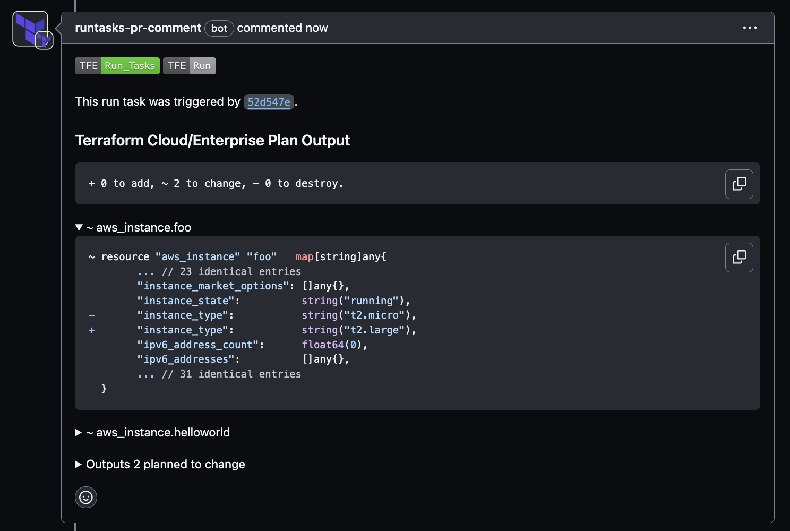

# runtasks-pr-comment
> [!WARNING]
> This project is not considered production ready and may contain bugs or incomplete features. Please use it cautiously in a production environment.

This is a custom Run Task for Terraform Cloud/Enterprise that enables reviewing the results of a plan as comments.

## Prerequisites
To use this custom run task you need to have the following:
1. Terraform Cloud/Enterprise with Run Task entitlement (You can use 1 Run task integration under Free tier.)
2. Authorizing your GitHub repositories using Personal Access Token (PAT) or GitHub App.

## Usage
* Deploy `runtasks-pr-comment` as a webhook server. You can also use [ngrok](https://ngrok.com/) for testing purposes. To run you need to provide inputs as enviroment variables. If you use Github App for authorizing access to GitHub you need not to provide `GITHUB_OAUTH_TOKEN`, but `GITHUB_APP_ID`, `GITHUB_APP_PRIVATE_KEY` and `GITHUB_APP_INSTALLATION_ID` are required.

| Name | Required | Description | 
|------|---------|---------|
| `GITHUB_OAUTH_TOKEN`         | yes for PAT         | The token string you were given by your VCS provider, e.g. ghp_xxxxxxxxxxxxxxx for a GitHub personal access token.  |
| `GITHUB_APP_ID`              | yes for Github APP  | The app id of the Github App. |
| `GITHUB_APP_PRIVATE_KEY`     | yes for Github APP  | The private key of the Github App. |
| `GITHUB_APP_INSTALLATION_ID` | yes for Github APP  | The installation id of the Github App. |
| `TFC_RUN_TASK_HMAC_KEY`      | yes | HMAC key to verify run task. |

* Create the run task in Terraform Cloud/Enterprise using the UI or [tfe](https://registry.terraform.io/providers/hashicorp/tfe/latest/docs/resources/organization_run_task) provider. HMAC key must be the same with `TFC_RUN_TASK_HMAC_KEY`.

* Enable the run task on a specific workspace. This can also be done using UI or [tfe](https://registry.terraform.io/providers/hashicorp/tfe/latest/docs/resources/workspace_run_task) provider. The Run stage must be set to Post-plan. Please refer to [here](https://developer.hashicorp.com/terraform/cloud-docs/workspaces/settings/run-tasks#associating-run-tasks-with-a-workspace) for more details.
